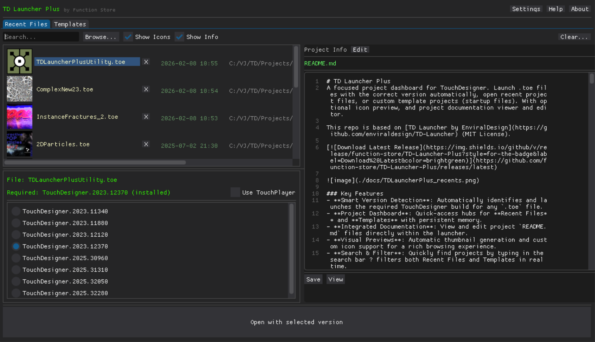

# TD Launcher Plus
A focused project dashboard for TouchDesigner. Launch .toe files with the correct version automatically, open recent project files, or custom template projects (startup files). With optional icon preview, and project documentation viewer and editor.

This repo is based on [TD Launcher by EnviralDesign](https://github.com/enviraldesign/TD-Launcher) (MIT License).

[](https://github.com/function-store/TD-Launcher-Plus/releases/latest)



### Key Features
- **Smart Version Detection**: Automatically identifies and launches the required TouchDesigner build for any `.toe` file.
- **Project Dashboard**: Quick-access hubs for **Recent Files** and **Templates** with persistent memory.
- **Integrated Documentation**: View and edit project `README.md` files directly within the launcher.
- **Visual Previews**: Automatic thumbnail generation and custom icon support for a rich browsing experience.
- **Keyboard Navigation**: Full keyboard navigation with tab memory for fast and fluid workflow.
- **Native Experience**: Fully optimized for macOS (Apple Silicon/Intel) and Windows with a clean, responsive Dear PyGui interface.
- **Sync Utility**: Companion component for TouchDesigner to keep your history updated and icons generated.

---

## What's this for

TD Launcher Plus is a project manager for TouchDesigner that helps you keep track of your projects and launch them with the correct version automatically. It also includes a built-in documentation viewer and editor, so you can keep your project notes up to date.

It can serve as a go-to dashboard for your TouchDesigner projects, whether you're working on a single project or many. It can also be used as a quick way to launch TD with a specific version, or to open a specific project.

## How this works

TD Launcher Plus operates in two primary modes depending on how it's opened:

### 1. Automatic Launch Mode
When you open a `.toe` file with TD Launcher Plus (via double-click or drag-and-drop), it instantly analyzes the file to find the required TouchDesigner version. It then presents a 5-second countdown timer.
- **Auto-launch:** If left undisturbed, the project opens in the detected version automatically.
- **Interruption:** Clicking anywhere or pressing a key stops the timer, allowing you to manually override the TD version or view project notes.

### 2. Dashboard Mode (Project Manager)
Launching the app directly opens the project dashboard. Here you can browse your **Recent Files** and **Templates** library. 
- **Smart Discovery:** The tool scans your system for all installed TouchDesigner versions and presents them as options.
- **Integrated Docs:** Selecting a project instantly loads its project info and README.md (if present) into the side panel. 
- **Keyboard Workflow:** Designed for speed with full keyboard navigation, tab memory, and debounced analysis for a smooth browsing experience.

## How to use

### Windows
1. Download the installer from the releases page on the right
2. Run the installer to install TD Launcher Plus
3. Set Windows to open `.toe` files with TD Launcher Plus by default
4. Double-clicking `.toe` files will now launch them with TD Launcher Plus

### macOS
1. Download the `.dmg` file from the releases page
2. Open the DMG and drag "TD Launcher Plus" to the "Applications" folder
3. **File association is automatic!** TD Launcher Plus will appear as an option for `.toe` files
4. **Optional:** To make it the default, right-click any `.toe` file → "Get Info" → set "Open with" to "TD Launcher Plus" → "Change All..."
5. Double-clicking `.toe` files will now launch them with TD Launcher Plus

### Alternative Usage
You can also drag and drop `.toe` files directly onto the TD Launcher Plus app icon.

### TouchDesigner Utility Component (Recommended)
A companion TouchDesigner component (`TDLauncherPlusUtility.tox`) is included that integrates with TD Launcher Plus. **For best results, add this to your default startup file** so it's always available.

**Why use it?**
Without this utility, only files launched through TD Launcher Plus appear in the Recent Files list. The utility bridges this gap by notifying the launcher whenever you save a project directly in TouchDesigner.

**Features:**
- **Sync recent files:** Transmits project data to TD Launcher Plus when you save, so files opened directly in TouchDesigner also appear in Recent Files
- **Auto-generate icons:** Takes a snapshot of the `/perform` window each time the project is saved, creating `icon_temp.png` for the project thumbnail
- **Manual icon creation:** Create a custom icon that takes priority over automatic snapshots
- **Quick access:** Open TD Launcher Plus directly from within TouchDesigner

**Installation:**
1. Import `TDLauncherPlusUtility.tox` into your project
2. Or better: Add it to your default startup `.toe` file (or one of the templates ;)) so it's always present --- it is very lightweight and does only minor file operations on init and save.
3. The utility runs automatically in the background

### Keyboard Shortcuts

**Navigation**
- **Tab**: Switch between "Recent Files" and "Templates" tabs
- **Up / W**: Select previous file
- **Down / S**: Select next file
- **Enter / Return**: Launch selected project (or start countdown)
- **Esc**: Quit application

**Interface Toggles**
- **H**: Toggle **"Full History"** mode (merges with TD's native recent files, duplicates removed)
- **C**: Toggle **"Show Icons"**
- **E**: Toggle **"Show Info"** (README) panel
- **Cmd + E** (Mac) / **Ctrl + E** (Win): Activate **Edit Mode** and focus text editor for immediate typing

**File Management**
- **Backspace / Delete**: Remove selected file from the list (with confirmation)
- **Cmd + Up** (Mac) / **Ctrl + Up** (Win): Move selected template up (Templates tab only)
- **Cmd + Down** (Mac) / **Ctrl + Down** (Win): Move selected template down (Templates tab only)
- **Cmd + S** (Mac) / **Ctrl + S** (Win): **Save** README changes (while in Edit Mode)
- **Cmd + Space** (Mac) / **Ctrl + Space** (Win): **Quick Launch** top template with newest TD version

---

## Features

### Automatic Version Detection
TD Launcher Plus analyzes each `.toe` file to determine which TouchDesigner version it was created with, then launches it with the correct version automatically.

- **Auto-launch timer:** After selecting a file, a 5-second countdown begins before launching
- **Click to interrupt:** Click anywhere to stop the countdown and manually select a different version
- **Missing version handling:** If the required version isn't installed, TD Launcher Plus shows a download link and lets you choose an alternative version

### Recent Files
TD Launcher Plus keeps track of recently opened projects. When you launch a `.toe` file, it's automatically added to the Recent Files list for quick access later.

**Full History Mode:** When enabled (toggle with **H** key), your launcher history is merged with TouchDesigner's native recent files list. Duplicate paths are automatically removed, with launcher-sourced files taking priority. Path comparisons are case-insensitive and ignore slash direction differences.

**Versioned files:** TouchDesigner auto-saves create versioned files like `project.7.toe`, `project.8.toe`, etc. TD Launcher Plus intelligently handles these:
- Versioned files are displayed as their non-versioned counterpart (e.g., `project.7.toe` shows as `project.toe`)
- Multiple versions of the same project appear only once in the list
- Files in a `Backup/` folder are shown with a `Backup/` prefix

### Templates
Save frequently-used project templates for quick access. Templates appear in a separate tab alongside Recent Files.

- Click **"Add Template..."** to add a `.toe` file as a template
- Templates persist between sessions
- Remove templates with the **X** button

### Project Icons
TD Launcher Plus can display project icons next to each file. Enable with the **"Show Icons"** checkbox. Icons are automatically generated when you save a project in TouchDesigner using the `TDLauncherPlusUtility.tox` component.

**Icon search order** (first found is used):
1. `icon.png` / `icon.jpg` / `icon.jpeg` in the project folder
2. `icon_temp.png` / `icon_temp.jpg` / `icon_temp.jpeg` (for auto-generated icons)
3. `<projectname>.png` / `.jpg` / `.jpeg` (e.g., `MyProject.png` for `MyProject.toe`)
4. `<projectname_without_version>.png` (e.g., `MyProject.png` for `MyProject.7.toe`)
5. Falls back to the TD Launcher Plus app icon

### Project Info Panel
Enable **"Show Info"** to display an editable README panel alongside the file picker.

- If a `README.md` exists in the project folder, it's loaded for viewing and editing
- If no README exists, you can create one by typing and clicking **Save**
- Changes are indicated with an asterisk (*) on the Save button
- Click **View** to open the README rendered as HTML in your default browser

---

## How to build

Built with Python 3.10+, PyInstaller, and [DearPyGui](https://github.com/hoffstadt/DearPyGui) for the UI.

> **Note:** PyInstaller-compiled executables downloaded directly from the internet tend to get flagged as false positive viruses (e.g. `Trojan:Win32/Wacatac.B!ml`). To avoid this for releases, the executable is bundled into a Windows installer using [Inno Setup](https://jrsoftware.org/isinfo.php), which compresses the contents into a format that bypasses download-time scanning.

### Windows Build

#### Prerequisites
1. **Python 3.10+** with pip
2. **TouchDesigner installed** (optional for running, but the bundled `toeexpand.exe` handles version detection)

#### Quick Setup
```bash
# 1. Clone the repository
git clone <repo-url>
cd TD-Launcher-Mac

# 2. Create and activate a virtual environment
python -m venv venv
.\venv\Scripts\activate

# 3. Install dependencies
pip install -r requirements.txt
```

#### Running from Source
```bash
# Run directly with Python
python td_launcher.py

# Or run with a test file
python td_launcher.py test.toe

# Enable debug logging
set TD_LAUNCHER_DEBUG=1
python td_launcher.py
```

#### Build Options

**Build the executable:**
```bash
BUILD.bat
```
- Creates `dist\td_launcher_plus.exe`
- Bundles `toeexpand.exe` and dependencies
- Includes TouchDesigner icon and app icon

**Build the installer (optional):**
1. Install [Inno Setup](https://jrsoftware.org/isinfo.php)
2. Open `inno\TD_Launcher_Inno_Compiler.iss` in Inno Setup
3. Build from there — the installer will appear in `inno\Output\`

#### Legacy Setup (bundled Python)

A bundled Python environment (`py.zip`) is also available for building without a system Python install:
1. Unzip `py.zip` into the root of the repo
2. Run `td_launcher.bat` to test
3. Run `BUILD.bat` to build (it uses `.\py\python.exe` by default)

### macOS Build

The macOS build is optimized for Apple Silicon (M1/M2/M3/etc) Macs and includes file association support for `.toe` files.

#### Prerequisites
1. **TouchDesigner installed** - Required for `toeexpand` utility
2. **Python 3.9+** with pip
3. **Xcode Command Line Tools**: `xcode-select --install`

#### Quick Setup
```bash
# 1. Clone the repository
git clone <repo-url>
cd TD-Launcher-Mac

# 2. Set up Python virtual environment
./setup_mac.sh

# 3. Build the app (simple version for development)
./BUILD_mac_simple.sh

# 4. Build creates automatic file association support
```

#### Build Options

**Development Build (Recommended):**
```bash
./BUILD_mac_simple.sh
```
- Quick build for testing
- Creates `dist/TD Launcher Plus.app`
- Includes debug logging support

**Distribution Build:**
```bash
./BUILD_mac.sh
```
- Full build with DMG creation
- Requires `brew install create-dmg` for DMG generation
- Creates both app bundle and installer DMG

#### Testing & Debugging

**Test the built app:**
```bash
# Test built app bundle with debug logging
export TD_LAUNCHER_DEBUG=1
open "dist/TD Launcher Plus.app" --args test.toe


```

**Run from source with debugging:**
```bash
# Enable debug logging
export TD_LAUNCHER_DEBUG=1
python3 td_launcher.py test.toe
```

#### File Association Setup

The built app automatically includes file association support for `.toe` files. After building:

1. **Install the app:**
   - Copy `dist/TD Launcher Plus.app` to `/Applications/`
   - Or install via the DMG (distribution build)

2. **Set as default (if needed):**
   - Right-click any `.toe` file
   - Select "Get Info"
   - In "Open with" section, select "TD Launcher Plus"
   - Click "Change All..." to set as default

**Note:** File associations activate automatically when the app is in `/Applications/`. No manual registration required.

#### Build Requirements

The build process requires these Python packages (automatically installed by `setup_mac.sh`):
- `dearpygui>=1.9.0` - GUI framework
- `pyinstaller>=5.0` - App bundling
- `Pillow>=9.0.0` - Icon processing

#### Architecture Notes

- **Apple Silicon**: Native ARM64 build for optimal performance
- **Intel Macs**: Can run via Rosetta 2 translation
- **Universal Binary**: Not supported due to dearpygui limitations

#### Troubleshooting


**TouchDesigner not detected:**
- Ensure TouchDesigner is installed in `/Applications/`
- Check that `toeexpand` exists in TouchDesigner.app bundle

**File association not working:**
- Ensure app is installed in `/Applications/`
- Try: Right-click `.toe` file → "Open With" → "TD Launcher Plus"
- Restart Finder: `killall Finder`
- Enable debug logging: `export TD_LAUNCHER_DEBUG=1` and check `~/Desktop/td_launcher_debug.log`

---

## Developer Notes

### Platform-Specific TOE File Analysis

TD Launcher Plus uses TouchDesigner's `toeexpand` utility to analyze `.toe` files and determine the required TouchDesigner version. The implementation differs between platforms:

#### Windows
- **Bundled approach**: Uses the `toeexpand.exe` included in the `toeexpand/` directory
- **Self-contained**: No dependency on installed TouchDesigner versions
- **Consistent**: Always uses the same `toeexpand` version regardless of system state

#### macOS
- **Dynamic discovery**: Searches for `toeexpand` within installed TouchDesigner applications
- **Location**: `TouchDesigner.app/Contents/MacOS/toeexpand`
- **Requirement**: At least one TouchDesigner installation must be present on the system
- **Fallback**: Uses the first available TouchDesigner installation found in `/Applications/`

#### Technical Details
```bash
# macOS: Dynamic path resolution
/Applications/TouchDesigner.2023.11600.app/Contents/MacOS/toeexpand -b file.toe

# Windows: Bundled utility
./toeexpand/toeexpand.exe -b file.toe
```

This approach ensures optimal compatibility on each platform while maintaining the core functionality of version detection.

# Contributors

- [Lucas Morgan](https://www.enviral-design.com/) - original TD Launcher with version picker
- [Dan Molnar / Function Store](https://functionstore.xyz/link-in-bio) - Cross platform implementation and "Plus" version including recent files, templates, icons, readme, utility
- [Keith Lostracco](https://github.com/keithlostracco) - Daily build signature support

---

If you have any issues, please post a bug issue here.
